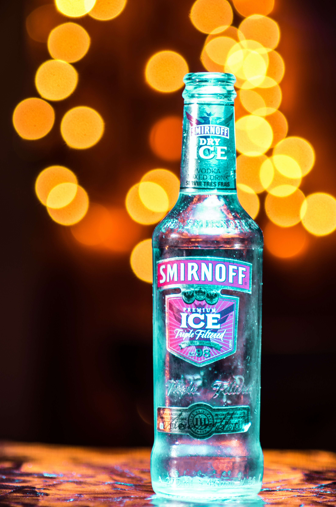
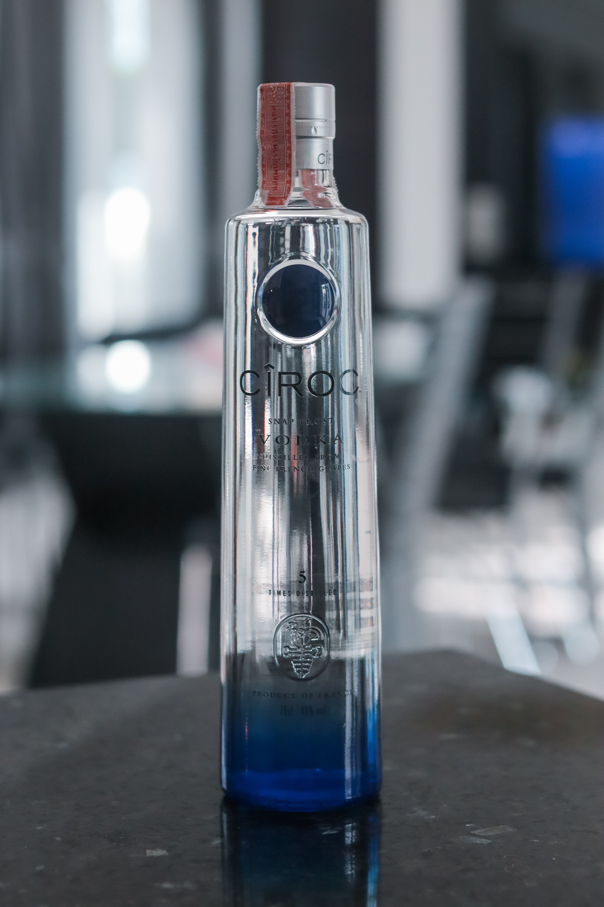
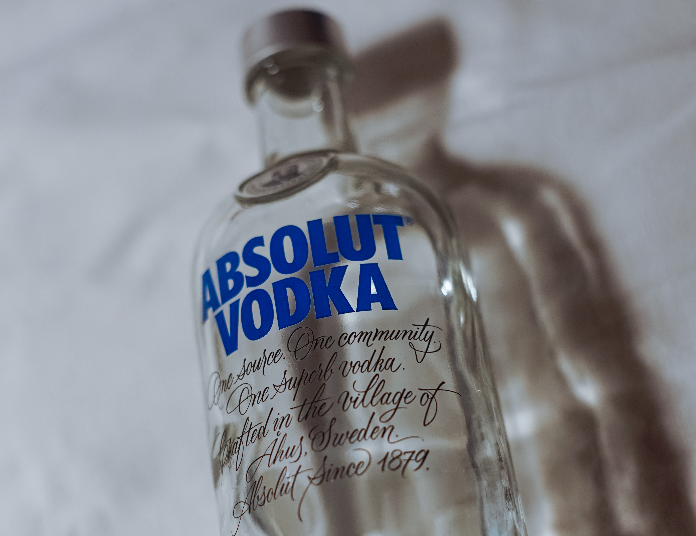

I thought it would only be right to start Tipsy Typography off with a blog post on the typography of vodka brands as vodka was one of the first types of alcohol most of us tried when we were growing up. I am going to explore how typefaces differ between vodka brands and why this is.

## **Smirnoff**

Smirnoff is a Russian vodka, first established in 1864. It uses the typeface called [Bell Centennial, a geometric and humanist san-serif font](https://issuu.com/justineparksart/docs/parks_explorationofvodkatypography). The type is bold and looks like it could be handwritten. There is low contrast between the letters and the type is monospaced, with a medium cap-height. The boldness of the type suggests the price-point of the vodka, which is more on cheaper side. The type being basic and bolshy also means it is more-likely to be targeted at younger people who do not want to pay as much for alcohol.

## **Grey Goose**

Grey Goose is a French vodka, established in the 1990s. It uses the typeface [Albertus, named after a German philosopher from the 13th century](https://fontmeme.com/grey-goose-font/#:~:text=The%20font%20used%20for%20the,vodka%20brand%20is%20Albertus%20Roman.&text=The%20designer%20named%20the%20font,century%20German%20philosopher%20and%20theologian.). It is a serif type and exerts luxury in its simplicity and elegant. As with Smirnoff, there is a low contrast between the letters and the type is monospaced, with a medium cap-height. The typeface matches the brand as it is a more expensive brand of vodka so the serif-style shows this and targets more of a middle/upper class audience.

## **Ciroc**

Ciroc is another French vodka, established in 2003. It uses the typeface called Trade Gothic, a sans serif font described by designers as a [“great no-nonsense typeface”](https://issuu.com/justineparksart/docs/parks_explorationofvodkatypography). The type for Ciroc is long and condensed, with a tall cap-height, and a high contrast between letters, giving it more of a classic and elegant feel. However, Ciroc is at more of a middle-ground in the terms of price-point, and this is shown by the brand’s use of sans serif font instead of Grey Goose’s use of serif type. [The ‘^’ as the dot](https://www.behance.net/gallery/47445135/CIROC-Re-Branding-Visual-Identity) for the ‘I’ in the type suggests the brand being for a more middle-class background as the ‘^’ points upwards.

## Absolut

Absolut is a Swedish vodka, [first launched in 1979 in New York](https://www.absolut.com/en/products/absolut-vodka/). It uses the [typeface Futura](https://issuu.com/justineparksart/docs/parks_explorationofvodkatypography), a popular, modern type. Futura is a sans serif font that is bold and monospaced with a low contrast, targeting young adults in a similar way to Smirnoff. Absolut’s price-point is similar to that of Ciroc, perhaps explaining its similar use of a sans serif font. However, Absolut’s bold choice of type coincides with that of Smirnoff, as the type is thicker, unlike that of Ciroc. It could be said that Absolut is Smirnoff’s bolder, more expensive older brother.

## In summary

It seems like most vodka brands tend to opt for a sans serif font when creating their branding, perhaps because vodka, as a spirit, is quite bold and also a staple type of alcohol for the majority of people. It is interesting to see the difference in typefaces used when looking at the difference in price-points for vodka brands. Grey Goose stands out as the most expensive type of vodka due to its classic serif typeface, making it look more luxurious in comparison to Smirnoff and Absolut, who use more brash sans serif typefaces and are of a cheaper price-point.