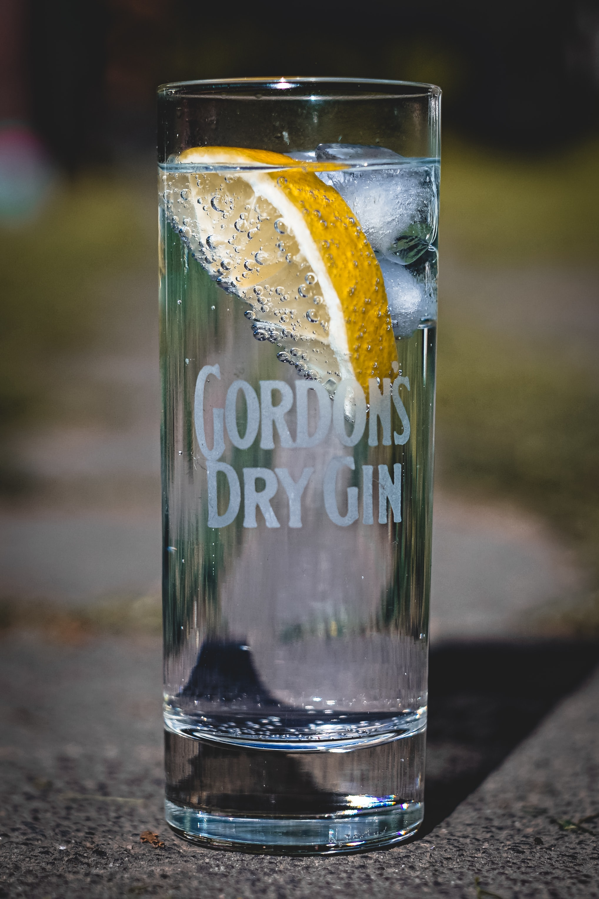
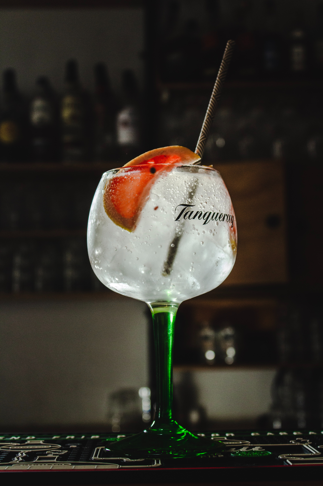
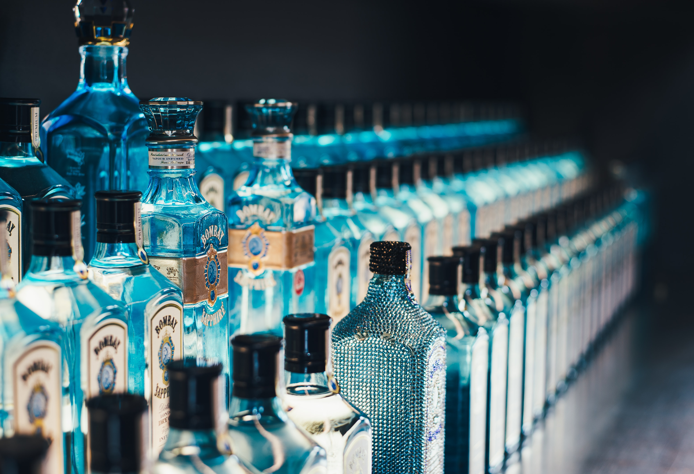

Gin has definitely been a spirit that has gained a lot of popularity over the past couple of years. This is perhaps down to a lot of people realising that tonic isn’t the only mixer that will go with gin and also due to the release of Gordon’s pink gin, the gin that led to the popularity of flavoured gins.

With so many gin brands out there, I thought it was worth looking into the typefaces of gin brands and how they differ to target different markets of gin drinkers.

## Gordon’s

[First established by Alexander Gordon in 1769](https://www.diageo.com/en/our-brands/brand-profiles/gordons/), Gordon’s has two different typefaces; one for all of their home-grown, British gins and one for their exported gins. The branding for their exported gins was first created when they had [their first request of a big order to be sent out to Australia.](https://www.gordonsgin.com/en-gb/about-gordons/) The new typeface was originally put onto their original green bottle but it [looked too bold](https://www.gordonsgin.com/en-gb/about-gordons/) with the colour so they decided to give it a clear bottle.

The original Gordon’s type used on its gins sold in Britain is an eloquent, script-style typeface [created by Andy Benedek](https://www.myfonts.com/person/Andy_Benedek/?details). The condensed line of the typeface and its scripted-manner gives the idea that Gordon’s is a traditional brand for a traditional audience. The cap-height is tall but the X-height is quite short. As it is a London-based gin, the type could be considered to be almost regal in its cursive manner.

The other Gordon’s typeface is quite different in comparison, using a bold serif font with a shadow effect on it.  The cap-height is quite tall, with high contrast, monospaced letters. The exact type is not known but the closest one to it is [LHF Hensler Regular, designed by Chuck Davis.](https://deltafonts.com/gordons-gin-font/)

## Tanqueray

Tanqueray was created back in the 1830s by [Charles Tanqueray in Bloomsbury, London](https://www.diageo.com/en/our-brands/brand-profiles/tanqueray/). The brand uses a thin script for its typeface with a cap-height that is not much taller than the X-height of the main lettering and the type is monospaced and high contrast, similar to that of Gordon’s. Like with Gordon’s, the scripted typeface targets Tanqueray’s intended audience of traditional gin drinkers that are likely to be more middle-class. It is also a London-based gin that’s been around for nearly two hundred years, so its traditional style of type matches up with the brand’s heritage.

## Bombay Sapphire

Bombay Sapphire was [launched in 1987 and distributed by Bacardi](https://www.ginfoundry.com/gin/bombay-sapphire-gin/). The actual typeface that Bombay Sapphire uses is unknown but they use a classic but bold serif font; the type is monospaced and of high contrast. The use of the serif typeface conveys the idea of “[class and heritage”](https://fabrikbrands.com/font-psychology-and-typography-inspiration-in-logo-design/) and “[serif fonts carry feelings of trust and respectability”](https://fabrikbrands.com/font-psychology-and-typography-inspiration-in-logo-design/) so moreover, it can be said that their typeface conveys that the brand is traditional and is respected in the gin market, representing how it is one of the most popular gins amongst traditional gin drinkers.

## Whitley Neill

Whitley Neill was [founded in 2004 by Johnny Neill](https://www.ginfoundry.com/gin/whitley-neill-gin/#:~:text=Whitley%20Neill%20is%20a%20premium,sets%20it%20apart%20from%20others.). The typeface for Whitley Neill, like most of the other gins, is unknown, but they use a classic sans serif type, with low contrast and monospaced lettering. The sans serif type is simplistic and condensed, suggesting a [modern brand](https://fabrikbrands.com/font-psychology-and-typography-inspiration-in-logo-design/#:~:text=Sans%20serif%20font%20psychology,%2C%20and%20no%2Dnonsense%20attitude.) that perhaps is not as classic as brands such as Bombay Sapphire or Tanqueray. In a similar way, their modern sans serif typeface represents Whitley Neill’s modern take on gins as they produce several different flavoured gins as opposed to the plain but traditional gins that Tanqueray and Bombay Sapphire produce.

## In summary

It seems that with gin brand typefaces, brands tend to opt for either script or serif typefaces to exacerbate the idea of tradition and class. Gin is often regarded as a simplistic yet classic drink and this is reflected in the typefaces of the brands but it is interesting to see how with Whitley Neill and the rise of flavoured gins, typefaces appear to change to represent more modern ideas with sans serif type.