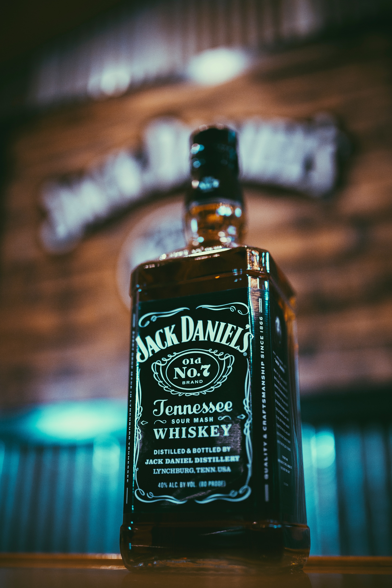
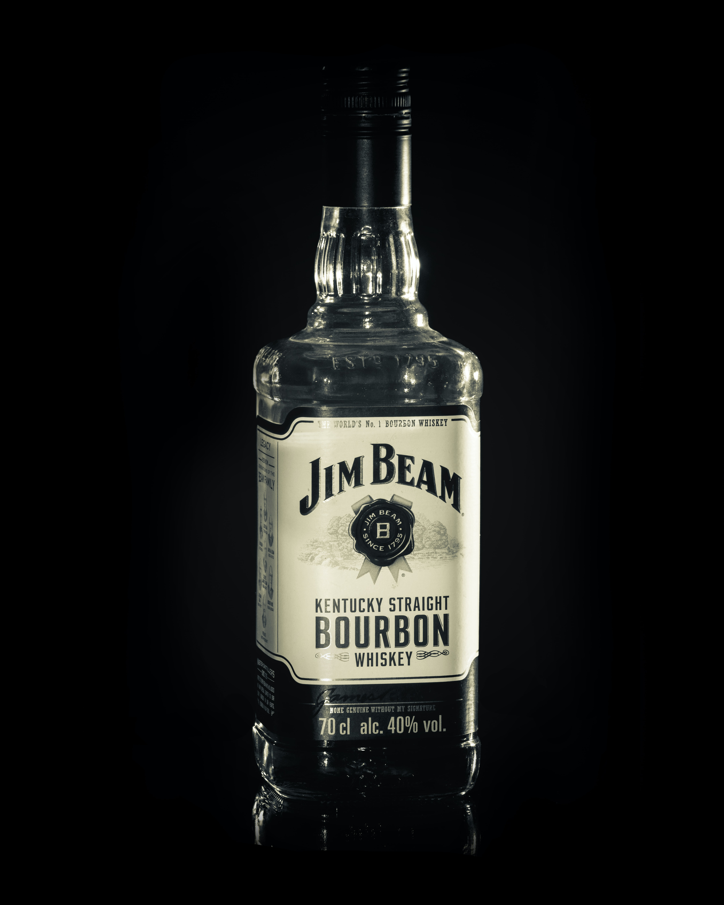
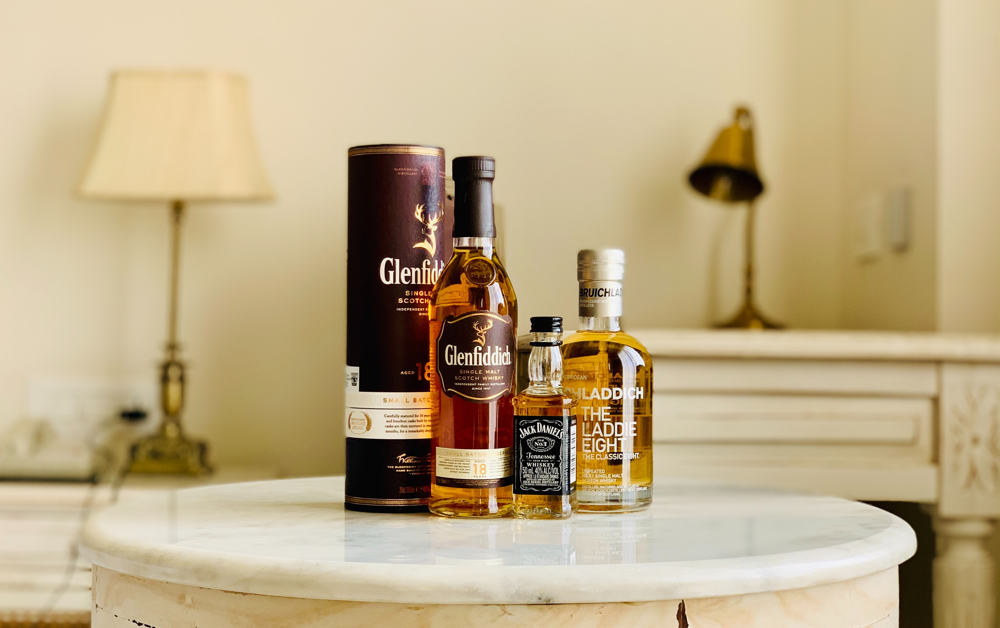
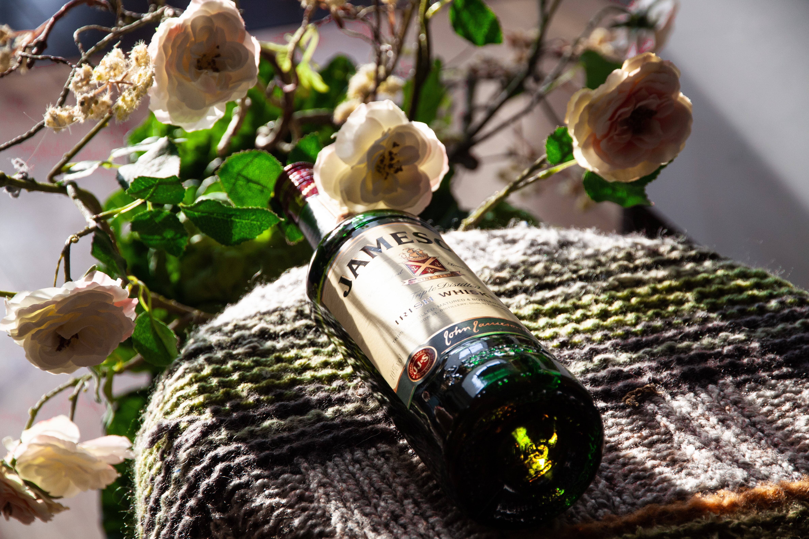

Typically, when people think of whiskey drinkers, they are more likely to be male than female. Is the mainly-male target audience reflected in the typography of whiskey brands? Let's see by exploring a variety of whiskey brands and their typography.

## Jack Daniel's

Jack Daniel's was established in [1866, with the 'Old No. 7' whiskey in Tennessee, USA.](https://www.jackdaniels.com/en-gb/our-story) The exact type used for the 'Jack Daniel's' part of the branding is unknown but it is similar to [Black No. 7 designed by Stefan Huebsch](https://fontmeme.com/jack-daniels-font/#:~:text=About%20Jack%20Daniels%20Font&text=Its%20wordmark%20Jack%20Daniel's%20was,Jackie_regular%20Alternative%20by%20Dario%20Muhafara.). The typography is a bold serif, and is monospaced and condensed, with quite a high contrast. The boldness of the type and the simple white-on-black of the branding suggests a bolshy, more masculine target audience. 

However, the brand uses a variety of typefaces in its logo, with the 'Tennessee' part of the branding in a scripted, high contrast type, similar to that of [Jackie_regular Alternative by Dario Muhafara](https://fontmeme.com/jack-daniels-font/#:~:text=About%20Jack%20Daniels%20Font&text=Its%20wordmark%20Jack%20Daniel's%20was,Jackie_regular%20Alternative%20by%20Dario%20Muhafara.). The scripted style of this part of the branding perhaps suggests the classic and traditional sense of the brand.

## Jim Beam

Jim Beam is a [straight bourbon whiskey established in 1795 in Kentucky, USA.](https://www.jimbeam.com/) The official typeface used in Jim Beam branding is unknown but the brand uses a bold, serif type. The typeface has a high X-height in comparison to its cap-height and its lettering has a high contrast but is monospaced. The typography also includes shadowing. 

Like with Jack Daniel's, the boldness of the type and the serifs used seems to target an audience with a male majority and also reflect the trusted, traditional brand.

## Glenfiddich

Glenfiddich, [Gaelic for Valley of the Deer, was established in 1887 by William Grant ](https://www.glenfiddich.com/uk/family-story/)in [Dufftown, Scotland](https://www.linkedin.com/pulse/typography-tales-character-behind-glenfiddich-font-jamie-fleming/). Glenfiddich underwent a rebranding in 2015 and with it they created two new typefaces, [Founder's Script and Glenfiddich Modern](https://www.linkedin.com/pulse/typography-tales-character-behind-glenfiddich-font-jamie-fleming/). Founder's Script is used for their main logo branding and is an elegant serif font. The typeface uses a medium X-height, is monospaced and has a low contrast. 

In comparison to the American whiskeys explored above, it can be said that American whiskey brands tend to opt for bolder serif typefaces, whereas whiskeys from overseas opt for more elegant typefaces. This could mean that non-American whiskey brands are not targeting a masculine audience in particular and marketing their brands to a wider and more inclusive audience.

## Jameson

Jameson was established in [1780 in Ireland by John Jameson](https://www.jamesonwhiskey.com/en-UK/our-story). Although the exact typeface for Jameson is unknown, it is similar to the [ITC Stone Serif family](https://www.goncalorodrigues.com/blog/jameson-irish-whiskey-typeface/). The Jameson typeface is similar to Glenfiddich, with the brand using a thin serif type. The typeface has a low contrast in its lettering and is monospaced.

The typography used in Jameson's branding suggests the idea that Jameson is a traditional, trusted brand, much like that of Glenfiddich. The type is thin and elegant in comparison to the American bold serifs used in Jack Daniel's and Jim Beam branding. The slick style of type perhaps targets a wider audience than the masculine American brands.

## In summary

The most obvious differences in whiskey brand typography is that the typefaces differ depending on what country they are from. American whiskey brands tend to opt for bold, serif types to target a mainly-masculine audience whereas the Scottish and Irish whiskey brands opt for more elegant and traditional serif types. All the brands explored have the serif types in common but what is most interesting is how this use of serifs differs.