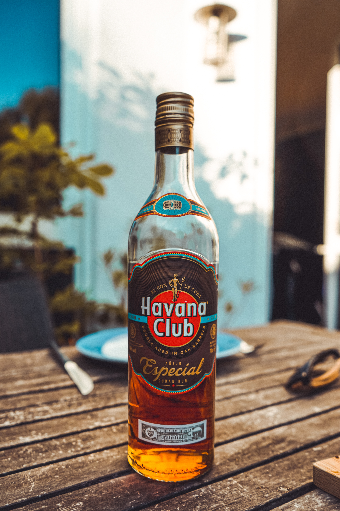

A rum and Coke is match made in heaven so I thought it would only be right to look at the variety of rums out there and the differences in their brand typography. Let’s get ready to rumble with this week’s rum brand typography!

## Bacardi

Bacardi was founded in [1862 by Don Facundo in Santiago de Cuba.](https://www.bacardi.com/heritage/) In 2014, the brand got a new logo and typeface, [designed by Here Design](https://fontmeme.com/bacardi-font/). The typeface appears to resemble the [Neutraface No. 2 Condensed Titling](https://houseind.com/hi/neutrafaceno2_condensed) by House Industries and is a bold, sans serif type. There is low contrast in the lettering and the type is monospaced.

Despite the brand being one of the oldest explored on this Tipsy Typography blog, the sans serif of the typeface suggests a modern brand. The old Bacardi typeface used to use a thin serif typeface, similar to the font [Perpetua Titling MT](https://fontmeme.com/bacardi-font/). Serif typefaces are typical of an older brand of alcohol so perhaps Bacardi wanted to step into the 21st century with this new, modern typeface.

## Captain Morgan

Captain Morgan was established in [1944 by Seagrams in the United States](https://vinepair.com/articles/11-things-you-didnt-know-about-captain-morgan/). The typeface for Captain Morgan is unknown, but unlike Bacardi, the brand uses a moderately-condensed serif typeface. The X-height of the lettering is quite high in comparison to the cap-height but the contrast in the lettering is quite low.

With the use of a thin serif typeface, the brand conveys the idea of a traditional brand that has been around for longer than it has. It could be suggested that perhaps Captain Morgan want to give this idea because their brand mascot is Captain Morgan, based on [Sir Henry Morgan, a Welsh privateer from the 1600s.](https://www.historic-uk.com/HistoryUK/HistoryofWales/Sir-Henry-Morgan/) Moreover, the use of a serif typeface gives the brand a historical feel. On the other hand, the typeface has a pirate-style theme, in the way pirates’ writing has been shown throughout history, matching the brand’s logo.

## Havana Club

Havana Club was [established in 1935 in Cuba](http://rumporter.com/en/story-havana-club/). The typeface used in Havana Club branding is [Futura Std Condensed Bold Font](https://fontslogo.com/havana-club-logo-font/), which is classed as a [geometric, sans serif typeface](https://en.wikipedia.org/wiki/Futura_(typeface)#:~:text=Futura%20Condensed%20is%20a%20condensed,fonts%20were%20released%20in%201936.). The typeface has a medium X-height in comparison to its cap-height, has a low contrast in its lettering and is monospaced. Havana Club also used a shadowing effect on their typeface to make the brand name appear as though it is in a spotlight in front of the dark background.

The boldness of the thick, sans serif type conveys the idea that the brand is modern, rather than traditional and therefore could be aimed at a younger audience. The geometric style of this typeface also suggests a modern brand, in stark contrast to the branding of Captain Morgan.

## Tanduay

Tanduay was established in [1854 by Ynchausti y Cia in Hagonoy, Bulacan in the Philippines.](https://www.rappler.com/brandrap/lifestyle-and-entertainment/tanduay-rhum-timeline-history) Like Captain Morgan, the typeface for Tanduay is unknown but the brand uses a capitalised, serif typeface. There is quite a high contrast in the lettering but it appears to be monospaced. They also use a shadowing effect like Havana Club to make the typography stand out against the red background.

Despite using a serif typeface, the lettering is bold, which would perhaps attract a traditionally-male target market. That being said, the use of the serifs in the typeface suggests a traditional, trusted brand like the one Tanduay are aiming to represent.

## In summary

As with other types of alcohol brands, it appears that the more modern types of rum such as Bacardi and Havana Club tend to opt for sans serif typefaces to target a fresh, modern audience; this is particularly evident in how Bacardi opted to change their typeface from using serifs to sans serif to make their brand more modern. The more traditional brands of rum like Tanduay tend to opt for serif fonts to portray that the brand is trusted and has been around and respected for years.