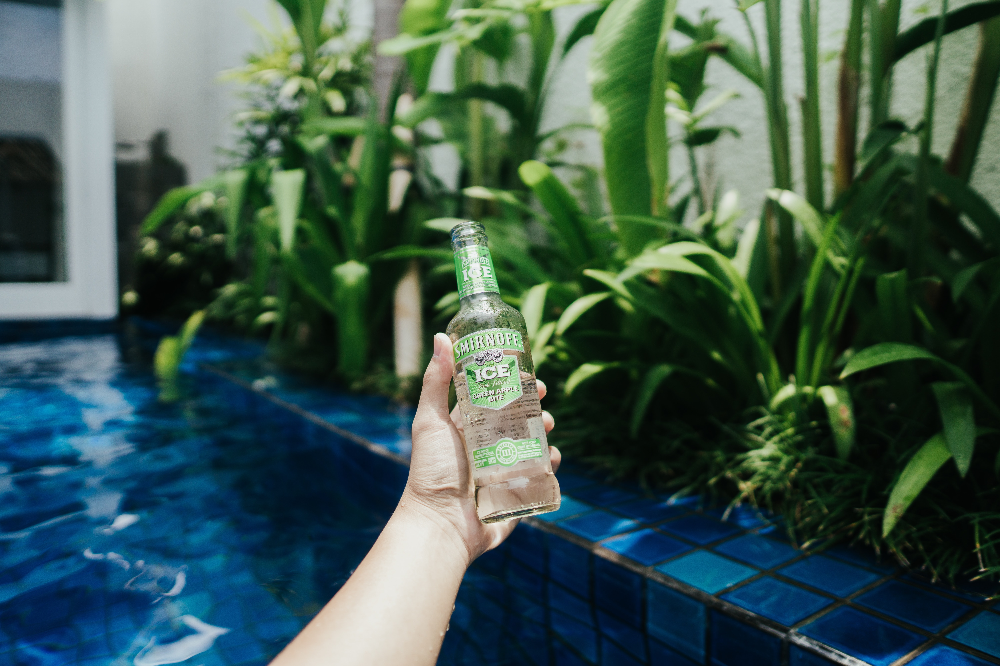
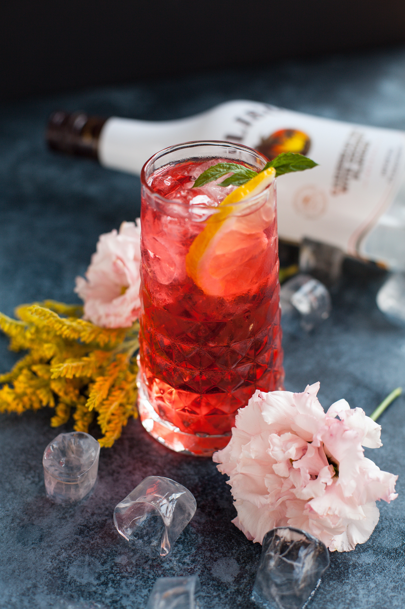

This week, I thought it would be fun to look at the branding of different alcopops, or ‘ready to drinks’, (RTDs) and see how the typography in their branding varies. Everyone remembers their favourite type of alcopop that they took to their first party; the excitement of having an alcoholic drink for the first time, making a face despite there being barely any alcohol in the drink and then slurping it like juice once you got used to it. Moreover, I decided to look back at the nostalgic days when our drink preferences were more likely to be Smirnoff Ice than a gin and tonic.

## Smirnoff Ice

Smirnoff Ice was [launched in 2002 in the US](https://www.adbrands.net/archive/uk/smirnoff-uk-p.htm#:~:text=In%202002%20Smirnoff%20Ice%20was%20launched%20in%20the%20US.). Its typeface is similar to that of Smirnoff vodka to show that it is part of the Smirnoff family. The ‘Smirnoff’ part of the branding remains in a bold sans serif type, with low contrast lettering and a tall cap-height.

However, the 'Ice' part of the branding is different; the typeface is unknown but the type for the ‘Ice’ part uses a bold serif font. The serifs are not very prominent but are different from the ‘Smirnoff’ part of the branding, with a slight slant to them. The lettering is low contrast but is condensed as opposed to the ‘Smirnoff’ part, which is more monospaced. The typeface’s boldness perhaps suggests its target audience being younger, along with the alcohol content being lower and better suited to younger audiences.

 

## Hooch

Hooch was launched in the [1990s, originally under the name of Hooper’s Hooch, named after the 1840s manufacturer of lemonade, William Hooper](https://www.diffordsguide.com/beer-wine-spirits/5073/hooch-alcoholic-lemon-brew).  The typeface for Hooch is unknown but the brand uses a bold sans serif typeface with a thin, pink outline. There is some contrast in the lettering and it is monospaced and slightly condensed.

The last ‘H’ in Hooch branding does have a serif on it, shaped like an arrow pointing downwards, perhaps to make the typeface a bit different and more noticeable. The sans serif typeface again targets a younger audience due to its boldness. The colours of yellow and pink make the branding seem luminous, almost like an electric sign that would be found outside a club.

 

## VK

VK is owned by [Global Brands and was created in 1999](https://www.globalbrands.co.uk/about-us/#history). The typeface used in VK branding is unknown but the brand uses a three-dimensional serif typeface. The typeface is monospaced and there is a moderate contrast in its lettering but it is not condensed.

Serif typefaces are more often linked to older, more classic brands as opposed to VK, a modern alcopop or ‘RTD’, that targets students as their main audience. Moreover, it could be said that the three-dimensional element to the typeface could suggest a more modern twist on the typical, traditional connotations of serif typefaces and therefore target the mid-audience of young adults.

## Malibu

Malibu was created in [1982 in Barbados](https://worddisk.com/wiki/Malibu_(rum)). Like the other alcopops in this blog post, the typeface used for Malibu’s branding is unknown but the brand uses a bold, three-dimensional slab serif typeface, much like VK.

 Malibu’s typeface features spaced-out letters, much like Smirnoff, with a moderate contrast in the lettering. The serifs of the typeface suggest a traditional brand which could be moderately representative of the brand as it is older than the rest of the brands explored in this blog post. However, in the same way as VK, they make their brand’s typography more modern by making the typeface three-dimensional and therefore target a more modern and younger audience.

 

## In summary

There is quite a variation of typefaces used in alcopop brands. However, they are all similar in how they all use bold typography to target their typically younger target audiences. Bold typography typically has connotations of modernism and therefore target a younger and modern audience that are likely to be drinking low-alcohol drinks like the ones mentioned in this article.