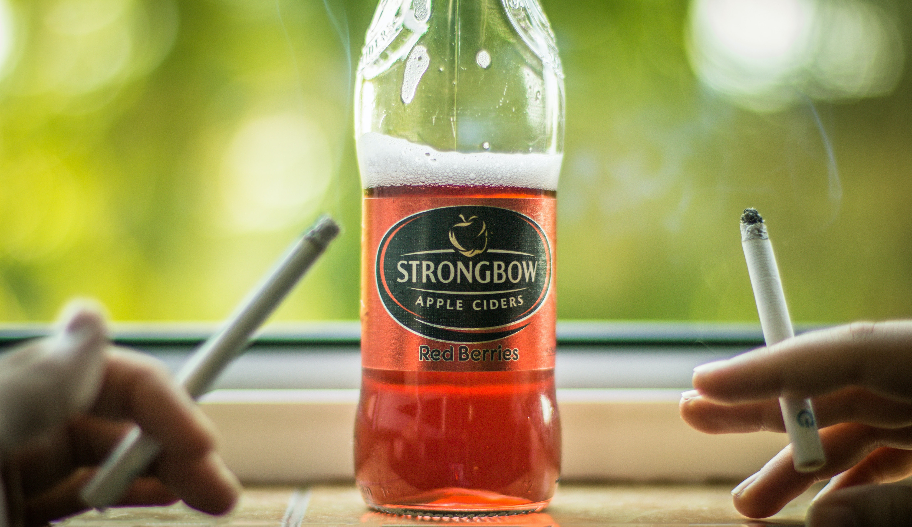

This week, I thought it was time to look at the typography of cider brands. There are quite a range of ciders around but I tried to narrow it down to include some popular ones but also more niche ones. 

## Old Mout

Old Mout was created in 1947. Its flavours were created in New Zealand, hence its Kiwi bird logo, but it is created in Hereford in the UK. Old Mout uses a serif-style typeface for its branding, with the type looking handwritten and personal. The style of the typeface is old-fashioned in the sense that it looks like it has been written by a feather and ink in how the contrast in the lettering is quite high; the thickness of each letter is different but there isn’t a pattern that the typeface complies with. It also looks like it could have been written on a typewriter as it matches that sort of style.

In terms of target audience, it appears to target a [younger audience of 18-34-year-olds](https://www.morningadvertiser.co.uk/Article/2017/08/25/Old-Mout-cider-Heineken-Young-s-sales#:~:text=It%20has%20a%20clear%20younger,bracket%20closely%20behind%20(37%25).), perhaps due to the fruity flavours being preferred by younger audiences, like we saw in my [alcopop article](https://tipsytypography.netlify.app/2020/11/06/all-about-alcopops/).

 

## Kopparberg

Kopparberg was originally founded in [1882 by 36 regional brewers but it was re-established in 1994 by the Bronsman brothers in the town Kopparberg, Sweden.](https://kopparberg.co.uk/our-story/) Kopparberg uses a bold serif typeface that is simple but effective. There is a low contrast in the lettering and the typeface has monospaced letters. The serifs are [bracketed and therefore, the typeface could be considered to be a slab serif.](http://r-blakemore1316-dp.blogspot.com/2014/04/type-journal-kopparberg.html) The use of serifs is atypical in how they have been used in a bold typeface and not a script typeface. The ‘K’ has a long terminal that is used to underline half of the word on the logo.

The boldness of the typeface also suggests the [main target audience of 18-34-year-olds](https://www.scottishgrocer.co.uk/2020/09/08/spirits-move-bears-fruit-for-kopparberg/#:~:text=Kopparberg%20is%20the%20number%20one,very%20much%20our%20target%20audience.) and this matches well with the fruity flavoured cider that is typically more popular with younger audiences too.

 

## Bulmers

Bulmers was originally established in [1887 in Hereford in the UK as HP Bulmer, becoming Bulmers Ltd Clonmel in 1946 when it purchased the Bulmers business in the Republic of Ireland.](https://candcgroupplc.com/magners-bulmers-history/) Bulmers’ typeface is unknown but the brand uses a blocky serif type in their logo. The serifs are small and barely noticeable so the typeface looks more like a sans serif typeface. The typography used is monospaced with a low contrast in the lettering. It is simplistic and quite old-fashioned and traditional, giving the idea that it is an old and well-established brand, in comparison to the likes of Old Mout and Kopparberg.

The old style of the typeface represents how the brand has been around for a while but also how they sell traditional apple cider as well as flavoured cider.

 

## Strongbow

Strongbow is [named after Richard de Clare, “one of England’s greatest knights” and was launched by HP Bulmer in 1960 in the UK.](https://uk.strongbow.com/about-us) Strongbow is the only cider brand in this article to use a sans serif typeface. There is not a lot of difference between the cap-height and x-height and the letters are monospaced. There is low contrast in the lettering and some of the letters have slanted angles on them, making the lettering less bulky.

Strongbow’s branding and typography targets [“working-class men”](https://www.campaignlive.co.uk/article/strongbow-repositions-brand-target-working-class-grafters/906670) in how it uses simple sans serif typography; there is nothing fancy about it.

 

## In summary

Overall, cider brands tend to opt for simplistic serif typefaces to represent their brands. The typefaces are often bold to target younger, more modern audiences, however brands such as Bulmers opted for a more traditional-looking typeface to target a slightly older target audience with their original flavour of cider as opposed to other brands such as Old Mout and Kopparberg who have more modern typefaces to represent the fruity flavours under their brand.